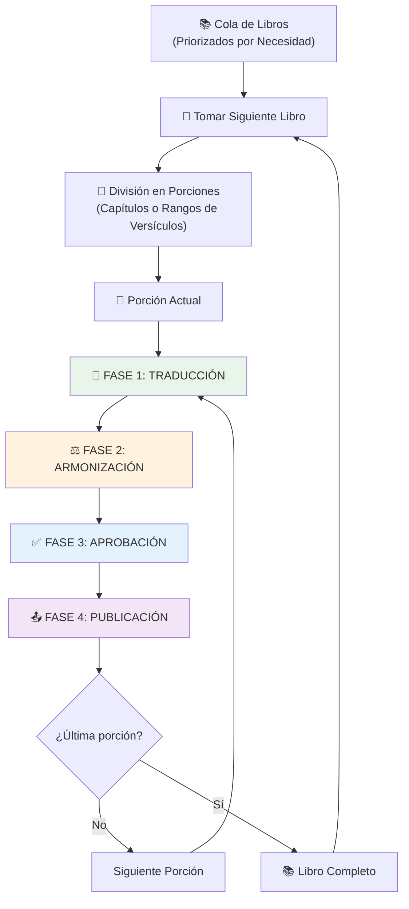
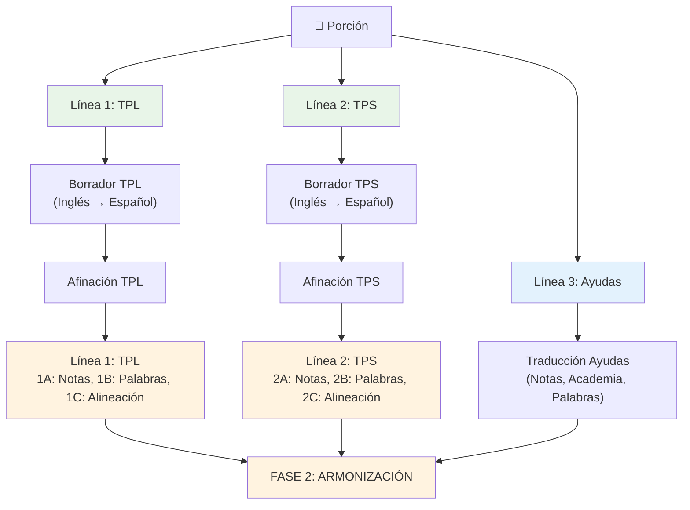
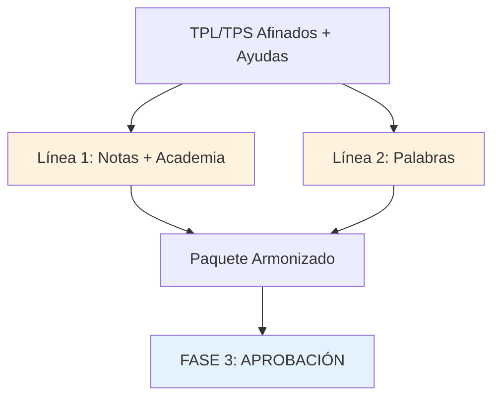

# Ciclo de Creación de Recursos v2

## Modelo de Traducción y Adaptación de Recursos Bíblicos

### Del Inglés al Castellano para Traducción Multilingüe

---

## Índice

1. [Introducción](#introducción)
2. [Resumen Ejecutivo](#resumen-ejecutivo)
3. [Contenido de los Paquetes de Traducción](#contenido-de-los-paquetes-de-traducción)
4. [Proceso de Adaptación](#proceso-de-adaptación)
5. [Especificaciones de Equipos y Perfiles](#especificaciones-de-equipos-y-perfiles)
6. [Diagramas de Flujo](#diagramas-de-flujo)
7. [Ventajas del Modelo y Escalabilidad](#ventajas-del-modelo-y-escalabilidad)
8. [Guía de Implementación](#guía-de-implementación)
9. [Gestión de Riesgos](#gestión-de-riesgos)
10. [Conclusión](#conclusión)
11. [Apéndices](#apéndices)

---

## Introducción

Este documento describe el **Ciclo de Creación de Recursos v2**, una nueva versión del modelo sistemático para la traducción y adaptación de recursos bíblicos desde el inglés al castellano. Esta versión representa una evolución significativa del modelo anterior, optimizando el proceso para mayor eficiencia y especialización. Los recursos en español producidos servirán como base para que traductores del cuerpo de Cristo que hablan otras lenguas puedan traducir la Biblia desde el castellano hacia sus idiomas nativos.

> 📋 **Documento complementario**: Para información sobre diferencias entre modelos, criterios de selección, procesos de migración y configuraciones adaptadas, consulte **[CCR2-plan-migracion.md](CCR2-plan-migracion.md)**

### Objetivo Principal

Crear paquetes de traducción completos, uno por cada libro bíblico, que contengan todas las herramientas necesarias para facilitar una traducción bíblica **Clara, Natural y Fiel**.

### Flujo General del Proceso

**Inglés** → **Castellano** → **Lenguas Indígenas/Minoritarias**

---

## Resumen Ejecutivo

**¿Qué es?** El **Ciclo de Creación de Recursos v2** es un modelo sistemático evolucionado para adaptar recursos bíblicos del inglés al castellano, creando paquetes de traducción que faciliten la traducción posterior a lenguas minoritarias.

**¿Qué incluye cada paquete?**

- **TPL** (Texto Puente Literal): Traducción fiel a estructuras originales
- **TPS** (Texto Puente Simple): Versión clara, accesible y fiel al significado original
- **Ayudas de traducción**: Notas, diccionario, academia y preguntas de traducción

**¿Cómo funciona?** 4 fases secuenciales:

1. **Adaptación y Afinación**: Equipos traducen TPL, TPS y ayudas en paralelo
2. **Armonización**: Integración y coherencia entre componentes
3. **Aprobación**: Validación por pastores latinoamericanos
4. **Publicación**: Disponibilización en Door43.org

**¿Quién participa?** Voluntarios enviados por iglesias comprometidas con servir a la Iglesia que no tiene la Biblia en su idioma. Modelo de mentoría con especialistas senior supervisando personal en formación.

**Resultado**: Recursos en castellano listos para traducción multilingüe con criterios de **Claridad, Naturalidad y Fidelidad**.

### 🚀 Innovación Clave del Modelo

**Publicación Progresiva vs. Publicación Completa**

- **Modelo Anterior**: Esperar a completar todo el libro antes de publicar
- **Modelo Nuevo**: Cada porción terminada del libro se publica inmediatamente
- **Impacto**: Reducción del 80-90% en tiempo de espera para recursos utilizables

**🔄 Cambio Transformador**: A diferencia del modelo anterior (libro completo antes de publicar), ahora **cada porción terminada se publica inmediatamente**, permitiendo que traductores accedan a recursos utilizables sin esperar muchos meses o años.

### 🆚 Modelos de Ciclo de Creación de Recursos

El **Ciclo de Creación de Recursos v2** es una evolución del modelo anterior que optimiza la producción mediante equipos especializados y publicación progresiva.

> 📋 **Para información detallada sobre diferencias entre modelos, criterios de selección, y procesos de migración**, consulte el documento **[CCR2-plan-migracion.md](CCR2-plan-migracion.md)**

**Innovación clave del v2**: Cada porción terminada se publica inmediatamente, reduciendo 80-90% el tiempo de espera para recursos utilizables.

---

> 💡 **¿Ya conoces los paquetes de traducción?**  
> Si ya estás familiarizado con el propósito y estructura general de los paquetes de traducción del CCR, puedes [saltar directamente a la siguiente sección sobre el proceso de adaptación](#proceso-de-adaptación-de-paquetes-de-traducción).

## Contenido de los Paquetes de Traducción

### ¿Qué Produce el Ciclo de Creación de Recursos?

El **Ciclo de Creación de Recursos (CCR)** no solo traduce la Biblia, sino que crea **paquetes completos de herramientas de traducción**. Cada paquete está diseñado para que traductores de lenguas indígenas puedan traducir la Biblia desde el castellano hacia sus idiomas nativos con **claridad, naturalidad y fidelidad**.

### ¿Por Qué Paquetes Completos?

**El Desafío**: Un traductor de lengua indígena que solo recibe el texto bíblico en español enfrenta múltiples obstáculos:

- ¿Cómo traducir términos teológicos complejos?
- ¿Qué hacer con pasajes culturalmente difíciles?
- ¿Cómo verificar que su traducción es fiel al original?
- ¿Dónde aprender técnicas específicas de traducción bíblica?

**La Solución**: Cada paquete del CCR incluye **todo lo necesario** para una traducción exitosa:

- **Textos base** en dos niveles (literal y simple)
- **Ayudas especializadas** para resolver dudas específicas
- **Metodología** para aprender técnicas de traducción
- **Control de calidad** para verificar fidelidad

### Impacto de los Paquetes Completos

**Antes del CCR**: Recursos fragmentados y dispersos

- Traductor busca ayudas en múltiples fuentes
- Inconsistencias entre diferentes recursos
- Pérdida de tiempo buscando información
- Calidad variable y no coordinada

**Con el CCR**: Ecosistema integrado y coherente

- Todo lo necesario en un solo paquete
- Componentes diseñados para trabajar juntos
- Terminología consistente entre todos los elementos
- Calidad uniforme y verificada

**Resultado**: El traductor de lengua indígena puede enfocarse en **traducir**, no en buscar herramientas.

### Estructura de Cada Paquete

Cada paquete de traducción corresponde a un libro específico de la Biblia y contiene seis componentes principales:

### Comparación Rápida de Componentes

| Componente | Propósito Principal | Cuándo lo Usa el Traductor | Tipo de Ayuda |
|------------|-------------------|---------------------------|---------------|
| TPL | Fidelidad estructural | Al traducir literalmente | Texto base literal |
| TPS | Claridad comunicativa | Al buscar expresiones claras | Texto base simplificado |
| Notas | Consultoría virtual | Al encontrar pasajes difíciles | Explicación verso por verso |
| Academia | Metodología | Al aprender técnicas de traducción | Manual de métodos |
| Palabras | Terminología | Al traducir términos teológicos | Diccionario especializado |
| Preguntas | Control de calidad | Al revisar su traducción | Lista de verificación |

### 1. Texto Puente Literal (TPL)

**Propósito**: Mantener la máxima fidelidad a las formas, estructuras y expresiones gramaticales de los recursos bíblicos en inglés, los cuales reflejan las lenguas originales (hebreo, griego y arameo).

**Características**:

- Preserva el orden de palabras del texto original
- Mantiene construcciones gramaticales específicas
- Refleja patrones sintácticos de las lenguas bíblicas
- Sirve como referencia para verificar precisión exegética

### 2. Texto Puente Simple (TPS)

**Propósito**: Representar de forma clara el significado de expresiones complejas o estructuras difíciles de traducir.

**Características**:

- Lenguaje claro y accesible
- Explicación de modismos y expresiones idiomáticas
- Simplificación de construcciones gramaticales complejas
- Facilita la comprensión del mensaje central

### 3. Notas de Traducción

**Propósito**: Funcionar como un "consultor virtual" que guía al traductor a entender conceptos complejos de cada versículo y los remite al artículo de la Academia de Traducción que les enseñe a entenderlos y a traducirlos.

**Contenido**:

- Explicaciones teológicas profundas
- Contexto histórico y cultural
- Alternativas de traducción
- Advertencias sobre errores comunes
- Referencias a los artículos de la Academia de Traducción
- Referencias cruzadas relevantes

### 4. Academia de Traducción

**Propósito**: Manual metodológico que explica principios y técnicas de traducción bíblica.

**Temas incluidos**:

- Manejo de metáforas y símiles
- Traducción de modismos
- Tratamiento de sustantivos abstractos
- Técnicas de naturalización
- Principios de equivalencia dinámica y formal

### 5. Palabras de Traducción

**Propósito**: Diccionario especializado que presenta todos los posibles significados de términos clave a lo largo de toda la Biblia.

**Características**:

- Definiciones exhaustivas de todos los significados bíblicos del término
- Términos teológicos complejos con sus variaciones semánticas
- Palabras con múltiples significados según diferentes contextos bíblicos
- Equivalencias en diferentes registros lingüísticos
- Referencias cruzadas a todos los usos del término en las Escrituras

### 6. Preguntas de Traducción

**Propósito**: Lista de verificación para garantizar calidad en la traducción.

**Criterios de evaluación**:

- **Claridad**: ¿Es comprensible para el público objetivo?
- **Naturalidad**: ¿Suena natural en la lengua receptora?
- **Fidelidad**: ¿Transmite fielmente el mensaje original?

---

## Proceso de Adaptación de Paquetes de Traducción

### 🔄 Fases del Proceso

El proceso completo sigue un modelo de cuatro fases especializadas, cada una con equipos dedicados y objetivos específicos:

### Fase 1: Traducción (TPL, TPS y Ayudas)

**Objetivo**: Crear versión completa de todos los componentes, desde borrador hasta afinación.

**Estrategia Dual**: Esta fase utiliza un enfoque inteligente de traducción en dos etapas: primero desde inglés al español (más fácil conseguir traductores), luego reajuste hacia idiomas originales (más eficiente que traducir directamente desde griego/hebreo).

#### Flujo Paralelo (3 Líneas Principales)

La Fase 1 opera con **3 líneas paralelas independientes** que trabajan simultáneamente:

**Línea 1: TPL (Secuencial)**

1. **Borrador TPL**
   - **Equipo**: Traductores inglés-español (4 personas + coordinador)
   - **Función**: Traducción inicial inglés → español manteniendo estructuras literales
   - **Fuente**: ULT y otros recursos bíblicos en inglés
   - **Herramientas**: [Google Docs](https://docs.google.com) + [preview.door43.org](https://preview.door43.org)
   - **Ventaja**: Más fácil conseguir traductores inglés-español que especialistas en lenguas originales

2. **Afinación TPL** (3 sublíneas con flexibilidad organizacional)
   - **Equipo**: Especialistas en lenguas originales (hebreo y griego)
   - **Función**: Reajustar español para fidelidad a originales, no al inglés
   - **Fuente**: Textos originales (Griego NT, Hebreo AT) + inglés como referencia
   - **Herramientas**: [translationCore](https://translationcore.com) + textos originales

   **Sublíneas de Afinación TPL:**
   - **Línea 1.A**: Afinación TPL usando Notas (identificar elementos especiales referenciados en las notas y mantenerlos en forma literal para complementar las explicaciones)
   - **Línea 1.B**: Afinación TPL usando Palabras (consistencia terminológica)
   - **Línea 1.C**: Alineación TPL (adaptación exhaustiva al idioma original; translationCore alerta cuando cambios podrían afectar verificaciones previas de notas)

**Línea 2: TPS (Secuencial)**

1. **Borrador TPS**
   - **Equipo**: Traductores inglés-español (4 personas + coordinador)
   - **Función**: Traducción inicial inglés → español priorizando claridad y naturalidad
   - **Fuente**: UST y otros recursos bíblicos en inglés
   - **Herramientas**: [Google Docs](https://docs.google.com) + [preview.door43.org](https://preview.door43.org)

2. **Afinación TPS** (3 sublíneas con flexibilidad organizacional)
   - **Equipo**: Especialistas en lenguas originales (hebreo y griego)
   - **Función**: Reajustar español para fidelidad a originales, no al inglés
   - **Fuente**: Textos originales + inglés como referencia
   - **Herramientas**: [translationCore](https://translationcore.com) + textos originales

   **Sublíneas de Afinación TPS:**
   - **Línea 2.A**: Afinación TPS usando Notas (identificar elementos especiales referenciados en las notas y simplificarlos para ofrecer alternativas claras que complementen las explicaciones)
   - **Línea 2.B**: Afinación TPS usando Palabras (consistencia terminológica)
   - **Línea 2.C**: Alineación TPS (adaptación exhaustiva al idioma original; translationCore alerta cuando cambios podrían afectar verificaciones previas de notas)

**Línea 3: Ayudas (Paralelo independiente)**

- **Equipo**: Traductores inglés-español (6 personas + coordinador)
- **Función**: Traducir notas, academia, palabras y preguntas desde inglés
- **Herramientas**: [translationCore Create (tCC)](https://create.translationcore.com) - diseñada específicamente para traducción de ayudas
- **Enfoque**: Traducción directa (sin especialización teológica/lingüística)
- **Timing**: Trabaja completamente independiente de las líneas TPL y TPS
- **Nota**: El ajuste especializado se hace en la fase de armonización

#### Flexibilidad Organizacional en Afinación

**Configuración ideal (6 sublíneas paralelas)**:

- 1.A, 1.B, 1.C, 2.A, 2.B, 2.C trabajando simultáneamente
- Requiere: 6 especialistas en lenguas originales

**Configuración intermedia (2 líneas paralelas)**:

- Línea TPL ejecuta A, B, C secuencialmente
- Línea TPS ejecuta A, B, C secuencialmente
- Requiere: 4 especialistas (2 por línea)

**Configuración mínima (1 línea secuencial)**:

- TPL completo (A, B, C), luego TPS completo (A, B, C)
- Requiere: 2 especialistas mínimo

**Ventaja clave del diseño**: Los recursos en inglés no solo fueron traducidos desde originales, sino que el Literal y Simple en inglés ya respetan las reglas de cada tipo de texto. Esto significa que en la mayoría de los casos, la traducción del inglés al español naturalmente conservará estas reglas, facilitando el reajuste hacia la fidelidad a los idiomas originales.

### Fase 2: Armonización

**Objetivo**: Ajustar las ayudas al "tono" del TPL y TPS ya afinados.

> usamos **"tono"** para referirnos a que el TPL y TPS marcan la referencia en cuanto a la terminología y estilo de traducción como el tono en una canción define la melodía

**Principio**: TPL (principalmente) y TPS (en casos específicos) son la referencia; las ayudas se ajustan a ellos

#### Flujo Paralelo

**Línea 1: Notas y Academia**

- **Equipo**: Teólogos, lingüistas y metodólogos especializados
- **Función**: Ajustar ayudas traducidas al tono y terminología del TPL/TPS afinados
- **Referencia**: TPL (principalmente) y TPS (en pocos casos)
- **Especialización**: Contenido teológico, metodología de traducción,  consultoría con traductores de otras lenguas
- **Herramientas**: [Gateway Edit](https://gatewayedit.com)

**Línea 2: Palabras de Traducción**

- **Equipo**: Terminólogos y consultores especializados
- **Función**: Ajustar palabras traducidas para consistencia con TPL/TPS afinados
- **Referencia**: TPL (principalmente) y TPS (en pocos casos)
- **Especialización**: Terminología bíblica, consultoría con traductores de otras lenguas
- **Herramientas**: [Gateway Edit](https://gatewayedit.com)

**Proceso común**:

- **Excepción**: Si se identifica error en TPL/TPS → consultar con equipo de afinación
- **Convergencia**: Ambas líneas entregan componentes armonizados

### Fase 3: Aprobación

**Objetivo**: Sello de confianza eclesiástica basado en el proceso y las personas involucradas.

**Principio**: Los pastores confían en el proceso y en los involucrados (por conocimiento personal o participación directa)
**Equipo**: Pastores de diferentes denominaciones comprometidos con las misiones
**Objetivo clave**: Autoridad y diversidad denominacional para maximizar aceptación y receptividad del paquete
**Herramientas**: [preview.door43.org](https://preview.door43.org)
**Proceso**:

1. **Revisión general** (no profunda) del contenido
2. **Confianza en el proceso** y las personas involucradas
3. **Sello de aprobación** eclesiástica transdenominacional
4. **Envío a publicación**

**Estrategia de Diversidad Denominacional**:

- **Objetivo**: Maximizar aceptación y receptividad en diferentes contextos
- **Composición sugerida**: Bautista, Pentecostal, Presbiteriana, Metodista (u otras)
- **Beneficio**: Paquete respaldado por múltiples tradiciones teológicas
- **Resultado**: Mayor confianza y adopción en comunidades misioneras diversas

### Fase 4: Publicación

**Objetivo**: Hacer disponibles los recursos para comunidades de traducción.

**Equipo**: Especialistas técnicos
**Herramientas**: [git.door43.org](https://git.door43.org)
**Proceso**: Preparación → Publicación → Documentación → Comunicación

---

## Especificaciones de Equipos y Perfiles

### Estructura General de Equipos

| Fase | Equipo | Perfil Principal | Herramientas Principales |
|------|--------|------------------|-------------------------|
| **Fase 1: Traducción** | Equipo TPL | Traductores inglés-español | [Google Docs](https://docs.google.com) + [preview.door43.org](https://preview.door43.org) |
| **Fase 1: Traducción** | Equipo TPS | Traductores inglés-español | [Google Docs](https://docs.google.com) + [preview.door43.org](https://preview.door43.org) |
| **Fase 1: Traducción** | Equipo Ayudas | Traductores inglés-español | [translationCore Create (tCC)](https://create.translationcore.com) |
| **Fase 1: Traducción** | Equipo Afinación | Especialistas en lenguas originales (hebreo y griego) | [translationCore](https://translationcore.com) + textos originales |
| **Fase 2: Armonización** | Línea 1: Notas y Academia | Teólogos, lingüistas, metodólogos | [Gateway Edit](https://gatewayedit.com) |
| **Fase 2: Armonización** | Línea 2: Palabras | Terminólogos y consultores especializados | [Gateway Edit](https://gatewayedit.com) |
| **Fase 3: Aprobación** | Comité Pastoral | Pastores influyentes comprometidos con misiones (diferentes denominaciones) | [preview.door43.org](https://preview.door43.org) |
| **Fase 4: Publicación** | Equipo Técnico | Especialistas técnicos | [git.door43.org](https://git.door43.org) |

## Diagramas de Flujo

### Diagrama General del Proceso



### Detalle de Fase 1: Traducción



### Detalle de Fase 2: Armonización



### Corrida en Frío del Proceso

#### Ejemplo Práctico: Juan Capítulo 1

**Inicio del Proceso:**

1. **Selección**: Libro de Juan
2. **División**: Juan 1, Juan 2, Juan 3... Juan 21
3. **Cola inicial**: Juan 1 → Juan 2 → Juan 3 → ... → Marcos 1 → Marcos 2...

**Procesamiento de Juan Capítulo 1:**

**FASE 1: TRADUCCIÓN (3 Líneas Paralelas)**

**Línea 1: TPL (Secuencial)**

- **Equipo TPL - Borrador:**
  - Divide Juan 1 entre miembros del equipo
  - Traduce desde ULT manteniendo estructuras literales
  - Revisión en pares → Revisión grupal
  - **Entrega**: Borrador TPL pasa a Afinación TPL

- **Equipo TPL - Afinación:**
  - **Línea 1.A**: Afinación TPL usando Notas (identificar elementos especiales que las notas explicarán y mantenerlos en forma literal para complementariedad)
  - **Línea 1.B**: Afinación TPL usando Palabras (consistencia terminológica)
  - **Línea 1.C**: Alineación TPL (adaptación exhaustiva al idioma original; translationCore alerta cuando cambios podrían afectar verificaciones previas de notas)
  - **Flexibilidad**: Pueden ejecutarse en paralelo (ideal) o secuencialmente (mínimo)
  - **Entrega**: TPL afinado pasa a Armonización

**Línea 2: TPS (Secuencial)**

- **Equipo TPS - Borrador:**
  - Divide Juan 1 entre miembros del equipo
  - Traduce desde UST priorizando claridad y naturalidad
  - Revisión en pares → Revisión grupal
  - **Entrega**: Borrador TPS pasa a Afinación TPS

- **Equipo TPS - Afinación:**
  - **Línea 2.A**: Afinación TPS usando Notas (identificar elementos especiales que las notas explicarán y simplificarlos para ofrecer alternativas claras que complementen las explicaciones)
  - **Línea 2.B**: Afinación TPS usando Palabras (consistencia terminológica)
  - **Línea 2.C**: Alineación TPS (adaptación exhaustiva al idioma original; translationCore alerta cuando cambios podrían afectar verificaciones previas de notas)
  - **Flexibilidad**: Pueden ejecutarse en paralelo (ideal) o secuencialmente (mínimo)
  - **Entrega**: TPS afinado pasa a Armonización

**Línea 3: Ayudas (Independiente)**

- **Equipo Ayudas de Traducción:**
  - Traduce notas específicas de Juan 1
  - Traduce artículos de academia relacionados (solo los nuevos)
  - Traduce términos teológicos de Juan 1 (solo los nuevos)
  - Traduce preguntas de verificación para Juan 1
  - **Timing**: Trabaja completamente independiente de TPL y TPS
  - **Entrega**: Ayudas terminadas pasan directamente a Armonización

**FASE 2: ARMONIZACIÓN (Dos Líneas Paralelas)**

- **Recibe**: TPL afinado + TPS afinado + Ayudas terminadas
- **Principio**: TPL (principalmente) y TPS (en casos específicos) son la referencia

**Línea 1: Notas y Academia**

- **Equipo**: 3 teólogos, lingüistas y metodólogos especializados
- **Recibe**: Ayudas ya traducidas por traductores inglés-español
- **Ajusta notas** al tono y terminología del TPL (principalmente) y TPS (pocos casos)
- **Ajusta academia** para coherencia metodológica con TPL/TPS afinados
- **Especialización**: Contenido teológico y metodología de traducción
- **Herramientas**: [Gateway Edit](https://gatewayedit.com) para vista integrada

**Línea 2: Palabras de Traducción**

- **Equipo**: 3 terminólogos y consultores especializados en otras lenguas
- **Recibe**: Palabras ya traducidas por traductores inglés-español
- **Ajusta palabras** para consistencia terminológica con TPL (principalmente) y TPS (pocos casos)
- **Especialización**: Terminología bíblica y consultoría con traductores de otras lenguas
- **Herramientas**: [Gateway Edit](https://gatewayedit.com) para vista integrada

**Proceso Común**:

- **Excepción**: Si identifica error en TPL/TPS → consulta con equipo de afinación
- **Convergencia**: Ambas líneas entregan componentes armonizados
- **Entrega**: Paquete armonizado completo

**Flexibilidad**: Cada línea puede trabajar independientemente sin esperar la otra

**FASE 3: APROBACIÓN**

- **Comité**: Pastores comprometidos con las misiones de diferentes denominaciones
- **Diversidad estratégica**: Representación denominacional intencional para maximizar aceptación
- **Principio**: Pastores confían en el proceso y en las personas involucradas
- **Proceso**: Revisión general (no profunda) del paquete
- **Base de confianza**: Conocimiento personal de los involucrados o participación directa en el proceso
- **Autoridad**: Reconocimiento en el ámbito misionero de habla hispana
- **Objetivo**: Mayor receptividad del paquete en diferentes contextos denominacionales
- **Resultado**: Sello de aprobación eclesiástica ampliamente respaldado
- **Entrega**: Paquete aprobado para publicación con aceptación transdenominacional

**FASE 4: PUBLICACIÓN**

- Publicación parcial de Juan 1 en Door43
- Como no es la última porción, continúa el proceso
- **Siguiente**: Juan 2 entra al proceso

**Flujo Continuo:**
Mientras Juan 1 está en Armonización, Juan 2 ya está en Borrador, y Juan 3 espera en la cola. Esto mantiene todos los equipos trabajando continuamente sin interrupciones.

**Especialización en Herramientas:**
Cada equipo se convierte en experto de las herramientas específicas de su fase:

- **Equipo Borrador**: Domina Google Docs y preview.door43.org para consultar ULT/UST
- **Equipo Afinación**: Experto en translationCore con griego/hebreo e inglés fuente
- **Equipo Armonización**: Especialista en Gateway Edit para vista integrada de componentes
- **Equipo Aprobación**: Maneja preview.door43.org para revisión de paquetes
- **Equipo Publicación**: Experto en git.door43.org para publicación y gestión de versiones

## Ventajas del Modelo y Escalabilidad

### Comparación con el Modelo Anterior

#### Ciclo de Creación de Recursos v1 (Modelo Anterior)

- **Publicación**: Solo al completar todo el libro completo
- **Coordinación**: Coordinador general + coordinador por libro (varios libros simultáneos)
- **Especialización**: Un equipo por libro rotando por todas las fases secuencialmente
- **Flujo**: Lineal y secuencial por libro (Fase 1 → Fase 2 → Fase 3...)
- **Utilidad**: Traductores deben esperar meses/años para acceder a recursos
- **Riesgo**: Si hay problemas en una fase, ese libro se detiene completamente

#### Ciclo de Creación de Recursos v2 (Modelo Nuevo)

- **Publicación**: Porción terminada = porción publicada inmediatamente
- **Coordinación**: Coordinador general + coordinadores especializados por equipo (con menor carga de trabajo)
- **Especialización**: Equipos expertos dedicados a fases específicas
- **Flujo**: Paralelo y continuo (todas las fases activas simultáneamente)
- **Utilidad**: Traductores de lenguas minoritarias acceden a recursos conforme se van completando
- **Riesgo**: Problemas en una fase no afectan el flujo general. Si un equipo se retrasa el equipo de la fase anterior puede continuar con el siguiente capítulo o libro.

#### Ventajas Clave del Cambio

**🚀 Publicación Inmediata vs. Espera Completa**

- **Antes**: Traducir Juan completo (21 capítulos) antes de publicar algo útil
- **Ahora**: Juan capítulo 1 se publica tan pronto como está aprobado
- **Beneficio**: Traductores de Otras Lenguas pueden comenzar a trabajar con Juan 1 mientras se completan los paquetes de Juan 2, 3, etc.
- **Impacto**: Reducción de 80-90% en tiempo de espera para recursos utilizables

**👥 Especialización vs. Generalización**

- **Antes**: Un equipo hace TPL, luego TPS, luego Ayudas, luego Armonización
- **Ahora**: Equipo TPL siempre hace TPL, Equipo TPS siempre hace TPS
- **Beneficio**: Mayor expertise, velocidad y calidad por especialización
- **Impacto**: Curva de aprendizaje más rápida y resultados más consistentes

**📊 Medición de Progreso: Simple vs. Compleja**

- **Antes**: Progreso medido por "fase del CCR" (ej: "Mateo está en fase de armonización")
- **Problema**: Difícil de entender para personas no familiarizadas con el proceso
- **Ahora**: Progreso medido por porciones/capítulos completados (ej: "Mateo: 15/28 capítulos publicados")
- **Beneficio**: Comunicación clara y comprensible para iglesias, donantes y traductores
- **Impacto**: Mayor transparencia y facilidad de seguimiento del progreso

**🔍 Identificación de Cuellos de Botella: Invisible vs. Visible**

- **Antes (v1)**: Si un libro se retrasa, es difícil identificar en qué fase específica está el problema
- **Problema**: Un equipo rotativo puede tener dificultades en cualquier fase sin que sea evidente cuál
- **Ahora (v2)**: Cada fase tiene equipos dedicados, haciendo visible dónde se acumula el trabajo
- **Beneficio**: Fácil identificación de qué fase necesita más recursos o capacitación
- **Optimización**: Posibilidad de añadir más personas específicamente a la fase problemática
- **Impacto**: Resolución rápida de cuellos de botella y optimización continua del flujo

**⚡ Coordinación: Por Libro vs. Por Equipo Especializado**

- **Antes (v1)**: Coordinador general + coordinador por libro (cada coordinador gestiona un equipo que rota por todas las fases)
- **Ahora (v2)**: Coordinador general + coordinadores especializados por equipo (cada coordinador gestiona un equipo fijo en una fase específica)
- **Diferencia clave**:
  - **v1**: Coordinador debe reintroducir cada fase cuando el equipo cambia de paso
  - **v2**: Coordinador no reintroduce porque el equipo ya domina su fase específica
- **Ventaja v2**: Menor carga de trabajo para coordinadores especializados
- **Flujo natural**: El trabajo fluye de forma más natural y menos guiada
- **Beneficio**: Mejor gestión, menos cuellos de botella, mayor escalabilidad

**💻 Especialización en Herramientas vs. Reaprendizaje Constante**

- **Antes**: Un equipo debe aprender y reaprender diferentes aplicativos al moverse entre fases
- **Ahora**: Cada equipo domina completamente el aplicativo específico de su fase
- **Herramientas específicas por fase**:
  - **Borrador**: Google Docs + preview.door43.org (ULT/UST)
  - **Afinación**: translationCore (con griego/hebreo e inglés fuente)
  - **Armonización**: Gateway Edit (vista integrada de todos los componentes)
  - **Aprobación**: preview.door43.org (entrega de paquetes)
  - **Publicación**: git.door43.org (publicación y versiones)
- **Beneficio**: Mayor eficiencia, menos errores, dominio experto de cada herramienta
- **Impacto**: Reducción significativa en tiempo de capacitación y curva de aprendizaje

#### Comparación Visual de Modelos

```mermaid
graph TD
    subgraph "CICLO v1 - ANTERIOR"
        A1["📚 Libro"] --> B1["👥 Un Equipo"]
        B1 --> C1["📝 Borrador → 🔧 Afinación → ⚖️ Armonización → ✅ Aprobación"]
        C1 --> D1["📤 Publicación Completa"]
        D1 --> E1["⏰ Traductores Esperan <br/> el libro completo"]
    end
    
    subgraph "CICLO v2 - NUEVO"
        A2["📖 Porción"] --> B2["👥 Equipos Especializados"]
        B2 --> C2["📝 Traducción → ⚖️ Armonización → ✅ Aprobación"]
        C2 --> D2["📤 Publicación Inmediata"]
        D2 --> E2["🚀 Traductores Usan <br/> la porción terminada"]
    end
    
    style A1 fill:#ffcccc
    style E1 fill:#ffcccc
    style A2 fill:#ccffcc
    style E2 fill:#ccffcc
```



### Ventajas Operativas

#### 1. **Eficiencia Maximizada**

- **Procesamiento Paralelo**: Los equipos TPL, TPS y Ayudas trabajan simultáneamente, reduciendo el tiempo total de producción
- **Flujo Continuo**: La gestión de cola elimina tiempos muertos entre porciones
- **Optimización de Recursos**: Solo se traducen elementos nuevos (artículos de academia y palabras no traducidas previamente)
- **Reutilización**: Los recursos creados se acumulan y benefician a porciones posteriores

#### 2. **Calidad Asegurada**

- **Múltiples Revisiones**: Cada componente pasa por revisión en pares, grupal y técnica
- **Herramientas Especializadas**: translationCore garantiza consistencia y alineación
- **Armonización Integral**: Verificación de coherencia entre todos los componentes
- **Validación Pastoral**: Sello de confianza de líderes eclesiásticos reconocidos

#### 3. **Flexibilidad Adaptativa**

- **Capacidad Variable**: El modelo se adapta a la disponibilidad de cada equipo
- **Procesamiento Asíncrono**: Las ayudas pueden procesarse independientemente
- **Escalabilidad Horizontal**: Fácil incorporación de más miembros a los equipos
- **Modularidad**: Cada fase puede optimizarse independientemente

#### 4. **Desarrollo de Capacidades**

- **Modelo de Mentoría**: Especialistas senior capacitan a personal en formación
- **Transferencia de Conocimiento**: Preservación y transmisión de expertise
- **Sostenibilidad a Largo Plazo**: Formación de nueva generación de especialistas

#### 5. **Transparencia y Comunicación**

- **Medición Clara de Progreso**: Progreso expresado en porciones/capítulos completados vs. fases técnicas del CCR
- **Comunicación Efectiva**: Fácil comprensión para iglesias, donantes y comunidades beneficiarias
- **Seguimiento Intuitivo**: Cualquier persona puede entender "15 de 28 capítulos completados"
- **Rendición de Cuentas**: Mayor transparencia en el avance del proyecto

#### 6. **Optimización y Gestión de Recursos**

- **Visibilidad de Cuellos de Botella**: Fácil identificación de qué fase específica está causando retrasos
- **Asignación Dirigida de Recursos**: Posibilidad de añadir personas exactamente donde se necesitan
- **Optimización Continua**: Ajuste dinámico de recursos según el rendimiento de cada fase
- **Métricas Específicas**: Cada equipo puede medir y mejorar su rendimiento independientemente
- **Resolución Rápida**: Los problemas se identifican y resuelven antes de afectar todo el flujo

### Escalabilidad del Modelo

### Escenarios de Escalamiento

#### Escenario 1: Red de Iglesias Pequeña (27-31 voluntarios)

**Perfil**: Red de iglesias locales que envían voluntarios para servir a la Iglesia sin Biblia en su idioma

**Capacidades**:

- **Libros simultáneos**: 1 libro a la vez
- **Estructura**: 1 coordinador general, equipos según especificaciones mínimas
- **Herramientas**: Básicas (Google Workspace, translationCore)
- **Enfoque**: Libros cortos y medianos inicialmente

**Criterios de Selección de Libros**:

- **Necesidad del pueblo**: Priorizar libros que el pueblo indígena necesita y aún no tiene
- **Experiencia del equipo**: Comenzar con libros más cortos si el equipo es nuevo
- **Género literario**: Considerar la familiaridad del equipo con narrativa, epístolas, poesía, etc.
- **Complejidad teológica**: Evaluar el nivel de dificultad conceptual

**Estructura Organizacional**:

```
Coordinador General (1 persona)
├── Equipo TPL (4 personas + 1 coordinador especializado)
├── Equipo TPS (4 personas + 1 coordinador especializado)
├── Equipo Ayudas (6 personas + 1 coordinador especializado)
├── Afinación (4 personas + 1 coordinador especializado - idealmente 8: 4 TPL + 4 TPS)
├── Armonización (6 personas + 1 coordinador especializado: 3 notas + 3 palabras)
├── Aprobación (4 pastores)
└── Publicación (1 persona)

Total mínimo: 32 personas (27 + 5 coordinadores especializados)
Total ideal: 36 personas (31 + 5 coordinadores especializados)

Nota: Los coordinadores especializados tienen menor carga de trabajo 
porque los equipos ya dominan sus procesos específicos.
```

#### Escenario 2: Red de Iglesias Mediana (60-90 voluntarios)

**Perfil**: Denominación regional o red amplia de iglesias que envían voluntarios

**Capacidades**:

- **Libros simultáneos**: 2-3 libros en paralelo
- **Estructura**: Coordinadores por fase, múltiples equipos especializados
- **Herramientas**: Intermedias (+ sistemas de gestión de proyectos)
- **Enfoque**: Combinación estratégica de libros de diferentes tamaños

**Estrategia de Selección**:

- **Portfolio balanceado**: Combinar libros de diferentes tamaños según capacidad
- **Especialización**: Equipos pueden enfocarse en géneros literarios específicos
- **Priorización**: Basada en necesidades de los pueblos indígenas objetivo
- **Motivación**: Intercalar proyectos cortos con largos para mantener momentum

**Estructura Organizacional** (para 2-3 libros simultáneos):

```
Director de Proyecto (1 persona)
├── Coordinador Borrador
│   ├── Equipos TPL (8-12 personas: 4 por libro)
│   └── Equipos TPS (8-12 personas: 4 por libro)
├── Coordinador Ayudas
│   └── Equipos Ayudas (12-18 personas: 6 por libro)
├── Coordinador Afinación
│   └── Equipos Afinación (16-24 personas: 8 por libro idealmente)
├── Coordinador Armonización
│   └── Equipos Armonización (12-18 personas: 6 por libro)
├── Comité Aprobación (4+ pastores)
└── Equipo Publicación (2-3 personas)

Total aproximado: 60-90 personas
```

#### Escenario 3: Red de Iglesias Grande (135+ voluntarios)

**Perfil**: Denominación nacional o red internacional de iglesias comprometidas con la misión

**Capacidades**:

- **Libros simultáneos**: 5+ libros en paralelo
- **Estructura**: Gestión matricial, múltiples equipos especializados
- **Herramientas**: Avanzadas (+ automatización, dashboards)
- **Enfoque**: Producción continua y diversificada

**Estrategia de Producción**:

- **Portfolio diverso**: Capacidad para manejar libros de cualquier tamaño y género
- **Especialización completa**: Equipos dedicados por testamento y género literario
- **Pipeline continuo**: Flujo constante basado en demanda de los pueblos
- **Flexibilidad total**: Capacidad para abordar cualquier libro según necesidades

**Estructura Organizacional** (para 5+ libros simultáneos):

```
Director Ejecutivo (1 persona)
├── Gerente AT
│   ├── Equipos TPL AT (20 personas: 4 por libro)
│   ├── Equipos TPS AT (20 personas: 4 por libro)
│   └── Equipos Ayudas AT (30 personas: 6 por libro)
├── Gerente NT
│   ├── Equipos TPL NT (20 personas: 4 por libro)
│   ├── Equipos TPS NT (20 personas: 4 por libro)
│   └── Equipos Ayudas NT (30 personas: 6 por libro)
└── Gerente Operaciones
    ├── Afinación (40 personas: 8 por libro idealmente)
    ├── Armonización (30 personas: 6 por libro)
    ├── Aprobación (8+ pastores)
    └── Publicación (5 personas)

Total aproximado: 225+ personas para 5 libros
Mínimo funcional: 135+ personas
```

### Comparación de Escenarios

| Aspecto | Red Pequeña | Red Mediana | Red Grande |
|---------|---------|---------|--------|
| **Iglesias participantes** | 5-10 iglesias | 15-30 iglesias | 50+ iglesias |
| **Voluntarios enviados** | 32-36 | 65-95 | 140+ |
| **Libros simultáneos** | 1 | 2-3 | 5+ |
| **Tipos de libros** | Cortos y medianos | Todos los tamaños | Sin restricciones |
| **Tiempo setup** | 1 mes | 2-3 meses | 6+ meses |
| **Complejidad gestión** | Baja | Media | Alta |
| **Especialización** | Básica | Por género | Completa |

### Consideraciones de Tiempo por Tamaño de Libro

#### Libros Cortos (1-5 capítulos)

**Ejemplos**: 1 Juan (5 cap), 2 Juan (1 cap), 3 Juan (1 cap), Filemón (1 cap), Gálatas (6 cap)

- **Tiempo estimado**: 2-4 meses
- **Ventajas**: Resultados rápidos, alta motivación del equipo
- **Ideal para**: Organizaciones pequeñas, equipos nuevos, pruebas piloto

#### Libros Medianos (6-16 capítulos)

**Ejemplos**: Marcos (16 cap), Efesios (6 cap), Filipenses (4 cap), Santiago (5 cap)

- **Tiempo estimado**: 4-8 meses
- **Ventajas**: Balance entre complejidad y duración manejable
- **Ideal para**: Equipos con experiencia inicial, organizaciones medianas

#### Libros Largos (17+ capítulos)

**Ejemplos**: Mateo (28 cap), Lucas (24 cap), Romanos (16 cap), Génesis (50 cap)

- **Tiempo estimado**: 8-18 meses
- **Desafíos**: Requiere sostenimiento de motivación a largo plazo
- **Ideal para**: Equipos experimentados, organizaciones grandes

#### Libros Muy Largos (casos especiales)

**Ejemplos**: Salmos (150 cap), Crónicas (65 cap total), Isaías (66 cap)

- **Tiempo estimado**: 18+ meses
- **Estrategia especial**: División en sub-proyectos, equipos dedicados
- **Ideal para**: Solo organizaciones grandes con experiencia consolidada

#### Escalabilidad Horizontal (Más Equipos)

**Nivel 1: Básico (1 libro simultáneo)**

- 1 equipo por fase según especificaciones mínimas
- 1 coordinador general + 5 coordinadores especializados
- Procesamiento secuencial de libros
- 32-36 voluntarios total

**Nivel 2: Intermedio (2-3 libros simultáneos)**

- 2-3 equipos paralelos por fase
- Coordinadores especializados por área
- Múltiples colas de trabajo
- 65-95 voluntarios total
- Coordinación entre equipos

**Nivel 3: Avanzado (5+ libros simultáneos)**

- Múltiples equipos especializados
- Gestión matricial de recursos
- Coordinadores de área especializados
- 140+ voluntarios total

#### Escalabilidad Vertical (Más Capacidad por Equipo)

**Equipos mínimos (especificaciones base)**

- TPL: 4 personas + 1 coordinador, TPS: 4 personas + 1 coordinador
- Ayudas: 6 personas + 1 coordinador, Afinación: 4 personas + 1 coordinador
- Armonización: 6 personas + 1 coordinador
- Aprobación: 4 pastores, Publicación: 1 persona
- Coordinador general: 1 persona
- **Total**: 32-36 personas por libro

**Equipos expandidos (mayor capacidad)**

- Aumentar cada equipo en 50-100% según demanda
- Afinación separada: 4 TPL + 4 TPS = 8 personas
- División en sub-equipos especializados por género literario

**Equipos especializados (organizaciones grandes)**

- Equipos dedicados por testamento (AT/NT)
- Especialización por género (narrativo, epistolar, poético)
- Coordinadores especializados por área

#### Escalabilidad Geográfica

**Local**: Una región o país

- Equipos en la misma zona horaria
- Reuniones presenciales posibles
- Contexto cultural homogéneo

**Regional**: Múltiples países latinoamericanos

- Coordinación entre zonas horarias
- Diversidad de variantes del español
- Enriquecimiento cultural mutuo

**Global**: Participación mundial

- Equipos distribuidos globalmente
- Trabajo asíncrono maximizado
- Mayor pool de especialistas disponibles

### Estrategias de Escalamiento

#### 1. **Escalamiento Gradual**

```
Fase 1: Piloto (1 libro, 1 equipo por fase)
    ↓
Fase 2: Expansión (2-3 libros, equipos duplicados)
    ↓
Fase 3: Consolidación (5+ libros, múltiples equipos)
    ↓
Fase 4: Optimización (producción a escala completa)
```

#### 2. **Especialización por Género Literario**

- **Equipo Narrativo**: Génesis, Éxodo, Evangelios, Hechos
- **Equipo Poético**: Salmos, Proverbios, Cantares
- **Equipo Profético**: Isaías, Jeremías, Ezequiel
- **Equipo Epistolar**: Cartas paulinas, Cartas generales
- **Equipo Apocalíptico**: Daniel, Apocalipsis

#### 3. **Distribución por Testamentos**

- **Equipos AT**: Especialistas en Antiguo Testamento con conocimiento de inglés intermedio+
- **Equipos NT**: Especialistas en Nuevo Testamento con conocimiento de inglés intermedio+
- **Equipos Mixtos**: Para proyectos integrales

<!-- #### 4. **Modelo Hub and Spoke**
- **Hub Central**: Coordinación general y estándares
- **Spokes Regionales**: Equipos especializados por región
- **Beneficios**: Consistencia global + adaptación local -->

### Indicadores de Escalabilidad

#### Métricas de Capacidad

- **Libros procesados simultáneamente**
- **Porciones completadas por mes**
- **Tiempo promedio por libro**
- **Utilización de recursos humanos**

#### Métricas de Calidad

- **Porcentaje de aprobación en primera revisión**
- **Número de iteraciones promedio**
- **Satisfacción de usuarios finales**
- **Consistencia terminológica entre libros**

#### Métricas de Sostenibilidad

- **Retención de voluntarios**
- **Tiempo de capacitación de nuevos miembros**
- **Número de especialistas senior formados**
- **Diversidad geográfica de participantes**

### Beneficios de la Escalabilidad

#### Para el Proyecto

- **Mayor Velocidad**: Producción acelerada de recursos
- **Mejor Calidad**: Especialización y experiencia acumulada
- **Menor Riesgo**: Distribución de dependencias críticas
- **Mayor Alcance**: Cobertura de más lenguas objetivo

#### Para los Participantes

- **Desarrollo Profesional**: Oportunidades de crecimiento y liderazgo
- **Red de Contactos**: Conexiones globales en traducción bíblica
- **Flexibilidad**: Opciones de participación según disponibilidad
- **Impacto**: Contribución a un proyecto de alcance mundial

#### Para las Iglesias Receptoras

- **Recursos Más Rápidos**: Acceso acelerado a herramientas de traducción
- **Mayor Variedad**: Recursos para diferentes géneros y contextos
- **Mejor Calidad**: Beneficio de la experiencia acumulada del sistema
- **Soporte Continuo**: Sistema sostenible a largo plazo

---

## Guía de Implementación

### 🎯 Implementación del Modelo v2

Este documento describe la implementación del **Ciclo de Creación de Recursos v2** para equipos que cuentan con los recursos necesarios (25+ personas, múltiples iglesias participantes, especialistas disponibles).

> 📋 **Para evaluación de modelos, criterios de selección, y procesos de migración desde v1**, consulte el documento **[CCR2-plan-migracion.md](CCR2-plan-migracion.md)**

### Proceso de Identificación de Necesidades

#### Consulta con Pueblos Indígenas

1. **Contacto directo**: Comunicación con líderes y traductores de las comunidades
2. **Evaluación de recursos existentes**: Inventario de libros ya disponibles
3. **Priorización comunitaria**: Permitir que las comunidades definan sus necesidades
4. **Consideraciones pastorales**: Consultar con líderes espirituales locales

#### Criterios de Priorización

- **Urgencia pastoral**: Libros necesarios para enseñanza y discipulado
- **Uso litúrgico**: Textos utilizados en servicios religiosos
- **Demanda educativa**: Recursos para escuelas bíblicas y seminarios
- **Evangelización**: Libros apropiados para alcance misionero

### Especificaciones Detalladas de Equipos

#### Equipos de Borrador

- **Equipo TPL**: 4 personas mínimo
  - Conocimiento de inglés intermedio o superior
  - Enfoque en fidelidad estructural y formal
  - **Herramientas**: [Google Docs](https://docs.google.com) + [preview.door43.org](https://preview.door43.org) (ULT)
- **Equipo TPS**: 4 personas mínimo
  - Conocimiento de inglés intermedio o superior
  - Enfoque en naturalidad y accesibilidad
  - **Herramientas**: [Google Docs](https://docs.google.com) + [preview.door43.org](https://preview.door43.org) (UST)

#### Equipo de Ayudas de Traducción

- **Total**: 6 personas mínimo
- **Perfil**: Traductores inglés-español
- **Función**: Traducción directa de ayudas (notas, academia, palabras, preguntas)
- **Herramientas**: Google Docs + preview.door43.org
- **Nota**: NO requieren especialización teológica/lingüística (eso se hace en armonización)

#### Equipo de Afinación

- **Configuración mínima**: 4 personas (afinación combinada)
- **Configuración ideal**: 8 personas
  - 4 especialistas para afinación TPL (Especialistas en hebreo y griego)
  - 4 especialistas para afinación TPS (Especialistas en hebreo y griego)
- **Herramientas**: translationCore (con griego/hebreo e inglés fuente)
- Expertos en herramientas de alineación y verificación

#### Equipo de Armonización

- **Total**: 6 personas mínimo
  - 3 especialistas para armonización de notas y academia
  - 3 especialistas para armonización de palabras de traducción
- **Herramientas**: [Gateway Edit](https://gatewayedit.com) (vista integrada de todos los componentes por versículo)
- Teólogos, lingüistas y metodólogos con visión integral del proyecto
- Idealmente al menos una persona con experiencia trabajando con las etnias del pueblo indígena

#### Comité de Aprobación

- **Total**: 4 pastores mínimo
- **Perfil**: Pastores comprometidos con las misiones de diferentes denominaciones
- **Reconocimiento**: Por su trabajo misionero directo o por su apoyo significativo a las misiones
- **Base de confianza**: Conocen personalmente a los involucrados o participaron del proceso
- **Función**: Sello de aprobación eclesiástica (no revisión exhaustiva)
- **Proceso**: Revisión general (no profunda) del contenido
- **Herramientas**: [preview.door43.org](https://preview.door43.org) (para revisión general)
- **Representación denominacional**: Diversidad intencional para maximizar aceptación
- **Objetivo estratégico**: Mayor receptividad del paquete en diferentes contextos denominacionales
- **Resultado**: Confianza en el proceso y aprobación ampliamente respaldada
- Autoridad reconocida en sus comunidades

#### Equipo de Publicación

- **Total**: 1 persona mínimo
- **Herramientas**: [git.door43.org](https://git.door43.org) (publicación final y gestión de versiones)
- Especialista técnico en sistemas Door43
- Conocimiento de control de versiones con Git
- Capacidad de gestión de metadatos y publicación

#### Recursos Necesarios

**Herramientas por Fase**:

**Fase Borrador (TPL y TPS)**:

- **Google Docs** ([docs.google.com](https://docs.google.com)): Para traducción colaborativa del borrador
- **preview.door43.org** ([preview.door43.org](https://preview.door43.org)): Para consultar texto fuente ULT o UST en inglés

**Traducción de Ayudas (dentro de Fase 1)**:

- **translationCore Create (tCC)** ([create.translationcore.com](https://create.translationcore.com)): Diseñada específicamente para traducción de ayudas

**Afinación (dentro de Fase 1)**:

- **translationCore** ([translationcore.com](https://translationcore.com)): Para afinar TPL y TPS usando griego/hebreo y inglés fuente

**Fase Armonización**:

- **Gateway Edit** ([gatewayedit.com](https://gatewayedit.com)): Para armonizar todos los componentes, permite ver/editar todos los componentes de 1 versículo simultáneamente

**Fase Aprobación**:

- **preview.door43.org** ([preview.door43.org](https://preview.door43.org)): Para entregar paquetes al comité de aprobación

**Fase Publicación**:

- **git.door43.org** ([git.door43.org](https://git.door43.org)): Para publicación final y gestión de versiones

**Herramientas de Colaboración**:

- WhatsApp (comunicación)
- Zoom o Teams (reuniones)

### Cronograma de Implementación (Desde Cero)

#### Mes 1: Preparación Completa

- **Semana 1-2**: Comunicación con iglesias y recepción de voluntarios enviados
- **Semana 3**: Capacitación en herramientas y metodología
- **Semana 4**: Configuración de sistemas y pruebas piloto

#### Mes 2-X: Producción (variable según libro seleccionado)

- **Libros cortos (1-5 cap)**: 1-2 meses adicionales
- **Libros medianos (6-16 cap)**: 3-6 meses adicionales  
- **Libros largos (17+ cap)**: 6-12 meses adicionales

### ✅ Lista de Verificación para Coordinadores

#### Antes de Comenzar un Libro

**Preparación Inicial:**

- [ ] Iglesias contactadas y voluntarios recibidos
- [ ] Equipos formados con voluntarios enviados por las iglesias
- [ ] Herramientas instaladas y configuradas
- [ ] Cronograma establecido y comunicado a las iglesias
- [ ] Canales de comunicación activos (WhatsApp, etc.)
- [ ] Criterios de calidad definidos y compartidos
- [ ] Recursos bíblicos disponibles
- [ ] Pastores aprobadores de diferentes denominaciones identificados

#### Durante el Proceso

- [ ] Reuniones semanales de seguimiento con equipos
- [ ] Monitoreo de métricas de progreso
- [ ] Resolución proactiva de conflictos
- [ ] Comunicación regular con pastores aprobadores y iglesias enviadoras
- [ ] Backup regular de trabajo en progreso
- [ ] Documentación de decisiones importantes
- [ ] Celebración de hitos alcanzados con las iglesias participantes

**Para Incorporación de Nuevos Miembros:**

- [ ] Nuevos miembros asignados a mentores experimentados
- [ ] Capacitación paralela sin detener producción principal
- [ ] Tareas de apoyo asignadas antes de responsabilidades completas
- [ ] Documentación de procesos actualizada para nuevos miembros
- [ ] Evaluación regular del progreso de integración

#### Al Finalizar una Porción

- [ ] Revisión de lecciones aprendidas
- [ ] Actualización de procesos si es necesario
- [ ] Comunicación de resultados a iglesias participantes
- [ ] Preparación para siguiente porción
- [ ] Archivo de documentación del proyecto

### Escalamiento Post-Piloto

#### Después del Éxito del Piloto

1. **Documentar lecciones aprendidas**
2. **Refinar procesos basados en experiencia**
3. **Expandir a 2-3 libros simultáneos**
4. **Invitar más iglesias a enviar voluntarios**
5. **Desarrollar materiales de capacitación mejorados**

---

## Apéndices

### Apéndice A: Proceso Técnico de Afinación

#### Diferencias Clave en la Afinación por Tipo de Texto

**Función de la Afinación usando Notas de Traducción:**

Las **notas de traducción están diseñadas para el traductor de Otra Lengua**, pero el **afinador las usa** para identificar expresiones especiales en el texto y aplicar las reglas correctas del TPL y TPS, asegurando que **ambos textos trabajen complementariamente** con las notas.

**Proceso de Afinación TPL:**

- **Identificar elementos especiales**: Usar las notas para localizar metáforas, modismos, sustantivos abstractos, etc.
- **Aplicar reglas TPL**: Mantener estas expresiones en su forma original/literal
- **Asegurar complementariedad**: Verificar que el TPL proporcione la forma literal que la nota explicará al traductor de Otra Lengua

**Proceso de Afinación TPS:**

- **Identificar los mismos elementos**: Usar las mismas notas para localizar las expresiones especiales
- **Aplicar reglas TPS**: Simplificar y clarificar estas expresiones
- **Asegurar complementariedad**: Verificar que el TPS ofrezca una alternativa simplificada que la nota puede referenciar

**Ejemplo del Sistema Complementario:**

**Versículo**: "Jesús es la luz del mundo" (Juan 8:12)

- **TPL**: "Jesús es la luz del mundo" (mantiene la metáfora original)
- **TPS**: "Jesús es como una lámpara que ilumina a toda la gente" (forma simplificada)
- **Nota de Traducción**: "La palabra 'luz' aquí es una metáfora. Jesús se compara con la luz porque así como la luz nos ayuda a ver en la oscuridad, Jesús nos ayuda a entender la verdad de Dios. Puedes traducir esto manteniendo la metáfora (como en el TPL) o explicándola (como en el TPS). Ver Academia de Traducción: Metáforas."

**Resultado**: El traductor de Otra Lengua ve la forma literal (TPL), una alternativa simple (TPS), y la explicación completa (Nota) que lo remite a aprender más (Academia).

#### Papel de la Alineación (Líneas 1.C y 2.C)

La **alineación es donde ocurre la adaptación más exhaustiva** al idioma original. Después de los ajustes realizados en las líneas A y B, translationCore:

- **Facilita la alineación**: Permite al afinador conectar palabras/frases del español con el texto original (hebreo/griego)
- **Alerta sobre impactos**: Notifica al afinador cuando un cambio podría afectar la verificación ya realizada de una nota correspondiente al texto modificado
- **Señala dependencias**: Indica qué verificaciones previas (de notas o palabras) podrían necesitar revisión debido a las modificaciones
- **Permite revisión dirigida**: El afinador puede volver específicamente al texto correspondiente a la nota afectada para reverificar

Este proceso iterativo permite al afinador **saber cuándo revisar** elementos específicos, asegurando que el texto final mantenga tanto la **fidelidad al original** como la **coherencia con las reglas** de cada tipo de texto.

### Apéndice B: Glosario de Términos

**TPL (Texto Puente Literal)**: Traducción que inicia desde recursos inglés (ULT) hacia el castellano manteniendo estructuras literales, luego se reajusta en la fase de afinación para conformidad con idiomas originales (hebreo, griego y arameo). Estrategia: Inglés → Español → Reajuste hacia originales.

**TPS (Texto Puente Simple)**: Traducción que inicia desde recursos inglés (UST) hacia el castellano priorizando claridad y accesibilidad, luego se reajusta en la fase de afinación para conformidad con idiomas originales. Estrategia: Inglés → Español → Reajuste hacia originales.

**Afinación**: Proceso de reajuste donde los borradores españoles (traducidos desde inglés) se corrigen para fidelidad a idiomas originales (griego/hebreo), no al inglés. Ventaja: Es más eficiente reajustar español existente que traducir directamente desde originales.

**translationCore**: Software especializado para traducción bíblica que incluye herramientas de alineación, verificación terminológica y control de calidad.

**Door43.org**: Plataforma digital colaborativa para la publicación y distribución de recursos de traducción bíblica.

**Alineación**: Proceso de vincular palabras o frases del texto traducido al castellano con sus equivalentes en los textos fuente en las lenguas originales.

**Armonización**: Fase del proceso donde se integran y verifican la coherencia entre todos los componentes del paquete de traducción.

**Lenguas Minoritarias**: Idiomas hablados por comunidades pequeñas que típicamente carecen de recursos bíblicos completos.

**Equivalencia Dinámica**: Principio de traducción que busca producir el mismo efecto en el lector moderno que el texto original produjo en sus lectores originales.

**Equivalencia Formal**: Principio de traducción que busca mantener la forma y estructura del texto original tanto como sea posible.

### Apéndice C: Herramientas Recomendadas

#### Software Especializado por Fase

- **Google Docs** ([docs.google.com](https://docs.google.com)): Traducción colaborativa de borradores TPL y TPS
- **translationCore Create (tCC)** ([create.translationcore.com](https://create.translationcore.com)): Traducción específica de ayudas (notas, academia, palabras, preguntas)
- **preview.door43.org** ([preview.door43.org](https://preview.door43.org)): Consulta de textos fuente ULT/UST en inglés y entrega a aprobación
- **translationCore** ([translationcore.com](https://translationcore.com)): Afinación de TPL y TPS con griego/hebreo e inglés fuente
- **Gateway Edit** ([gatewayedit.com](https://gatewayedit.com)): Armonización integrada de todos los componentes por versículo
- **git.door43.org** ([git.door43.org](https://git.door43.org)): Publicación final y gestión de versiones

#### Herramientas de Colaboración

- **Google Workspace**: Documentos colaborativos, hojas de cálculo, presentaciones
- **Microsoft 365**: Alternativa a Google Workspace
- **Slack**: Comunicación de equipos
- **Discord**: Alternativa a Slack, popular entre voluntarios jóvenes
- **Zoom/Teams**: Videoconferencias y reuniones

#### Recursos Bíblicos Digitales

- **Bible Hub**: Concordancias y léxicos en línea
- **Blue Letter Bible**: Herramientas de estudio bíblico
- **Logos Bible Software**: Biblioteca digital extensa (de pago)
- **Accordance**: Alternativa a Logos (de pago)

#### Gestión de Proyectos

- **Trello**: Gestión visual de tareas (básico)
- **Asana**: Gestión de proyectos más robusta
- **Monday.com**: Plataforma integral de gestión
- **Notion**: Base de conocimiento y gestión combinadas

### Apéndice D: Plantillas de Documentos

#### Plantilla de Cronograma de Proyecto

```
LIBRO: [Nombre del libro]
FECHA INICIO: [DD/MM/AAAA]
COORDINADOR: [Nombre]

FASES:
□ Preparación (Semana 1)
  □ Formación de equipos
  □ Capacitación inicial
  □ Configuración de herramientas

□ Borrador (Semanas 2-5)
  □ TPL: Capítulos 1-X
  □ TPS: Capítulos 1-X
  □ Ayudas: Componentes específicos

□ Afinación (Semanas 4-7)
  □ Revisión TPL con translationCore
  □ Revisión TPS con translationCore
  □ Alineación con textos originales

□ Armonización (Semanas 6-8)
  □ Integración de componentes
  □ Resolución de inconsistencias
  □ Revisión final

□ Aprobación (Semana 9)
  □ Revisión pastoral
  □ Incorporación de feedback
  □ Aprobación final

□ Publicación (Semana 10)
  □ Preparación para Door43
  □ Publicación parcial
  □ Comunicación a usuarios
```

#### Plantilla de Reporte de Progreso

```
REPORTE SEMANAL - SEMANA [X]
LIBRO: [Nombre]
FECHA: [DD/MM/AAAA]

PROGRESO GENERAL:
- Porcentaje completado: [X]%
- Porciones terminadas: [X] de [Y]
- Próximos hitos: [Descripción]

POR EQUIPO:
□ TPL: [Estado y observaciones]
□ TPS: [Estado y observaciones]
□ Ayudas: [Estado y observaciones]
□ Afinación: [Estado y observaciones]
□ Armonización: [Estado y observaciones]

RIESGOS IDENTIFICADOS:
- [Riesgo 1]: [Descripción y plan de mitigación]
- [Riesgo 2]: [Descripción y plan de mitigación]

DECISIONES REQUERIDAS:
- [Decisión 1]: [Descripción y opciones]
- [Decisión 2]: [Descripción y opciones]

PRÓXIMOS PASOS:
1. [Acción 1]
2. [Acción 2]
3. [Acción 3]
```

### Apéndice E: Recursos de Capacitación

#### Módulo 1: Introducción al Modelo

- **Duración**: 2 horas
- **Contenido**: Visión general, objetivos, roles y responsabilidades
- **Formato**: Presentación + Q&A
- **Materiales**: Slides, manual del participante

#### Módulo 2: Herramientas Técnicas

- **Duración**: 4 horas
- **Contenido**: translationCore, Door43, herramientas colaborativas
- **Formato**: Taller práctico
- **Materiales**: Computadoras, cuentas de prueba

#### Módulo 3: Metodología de Traducción

- **Duración**: 6 horas
- **Contenido**: Principios TPL/TPS, técnicas específicas
- **Formato**: Seminario + ejercicios prácticos
- **Materiales**: Textos de práctica, guías metodológicas

#### Módulo 4: Trabajo en Equipo

- **Duración**: 3 horas
- **Contenido**: Comunicación, resolución de conflictos, coordinación
- **Formato**: Dinámicas grupales
- **Materiales**: Casos de estudio, ejercicios de rol

#### Recursos de Capacitación Continua

- **Webinars mensuales**: Temas especializados
- **Biblioteca digital**: Artículos, videos, tutoriales
- **Mentorías**: Programa de acompañamiento personalizado
- **Comunidad de práctica**: Foro de intercambio de experiencias

### Apéndice F: Casos de Estudio

#### Caso 1: Implementación Exitosa - Red de Iglesias Regional

**Contexto**: 8 iglesias locales enviaron 30 voluntarios comprometidos
**Libro piloto**: Libro corto (5 capítulos) solicitado por pueblo indígena
**Duración**: 3 meses (1 mes preparación + 2 meses producción)
**Resultados**:

- 100% de retención de voluntarios enviados por las iglesias
- Publicación exitosa en Door43
- Adopción por 3 proyectos de traducción
**Factores de éxito**:
- Compromiso pastoral fuerte de las iglesias enviadoras
- Comunicación clara con las iglesias sobre el llamado misionero
- Voluntarios motivados por servir a la Iglesia sin Biblia
- Selección basada en necesidad real del pueblo
- Libro corto permitió ver resultados rápidos y motivar a las iglesias

#### Caso 2: Desafíos Superados - Red Denominacional

**Contexto**: 15 iglesias de diferentes denominaciones enviaron 40 voluntarios
**Libro piloto**: Libro mediano (4 capítulos) de alta prioridad para pueblo objetivo
**Duración**: 6 meses (planificado 4)
**Desafíos**:

- Algunos voluntarios regresaron a sus iglesias por compromisos locales (40%)
- Problemas de coordinación entre iglesias de diferentes denominaciones
- Diferencias teológicas menores entre denominaciones
- Subestimaron complejidad del libro seleccionado
**Soluciones implementadas**:
- Mejor comunicación con pastores sobre el compromiso requerido
- Coordinadores denominacionales para facilitar comunicación
- Protocolo de resolución de diferencias teológicas
- Cronogramas más realistas comunicados claramente a las iglesias
**Resultados finales**:
- Proyecto completado exitosamente con iglesias comprometidas
- Lecciones aprendidas documentadas y compartidas
- Modelo replicado en otras regiones denominacionales
- Mejor comunicación inicial con iglesias para proyectos futuros

#### Caso 3: Escalamiento Gradual - Denominación Nacional

**Contexto**: Denominación nacional con 200+ iglesias comprometidas con la misión
**Estrategia**: Piloto → Expansión → Consolidación
**Cronograma**:

- Año 1: Piloto con 10 iglesias enviando 30 voluntarios (1 libro prioritario)
- Año 2: Expansión a 25 iglesias enviando 75 voluntarios (3 libros simultáneos)
- Año 3: Consolidación con 50+ iglesias enviando 150+ voluntarios (6 libros simultáneos)
**Resultados**:
- 15 libros completados según demanda de pueblos indígenas
- 50+ iglesias activamente involucradas en misión bíblica
- Modelo adoptado por denominaciones hermanas
- Sistema de priorización basado en necesidades reales de pueblos sin Biblia
- Red sólida de iglesias comprometidas con la traducción bíblica

### Apéndice G: Métricas y KPIs

#### Métricas de Productividad

- **Porciones completadas por mes**
- **Tiempo promedio por libro**
- **Libros publicados por año**
- **Utilización de recursos humanos**

#### Métricas de Calidad

- **Porcentaje de aprobación en primera revisión**
- **Número de iteraciones promedio**
- **Satisfacción de usuarios finales (escala 1-5)**
- **Consistencia terminológica entre libros**

#### Métricas de Sostenibilidad

- **Retención de voluntarios (%)**
- **Tiempo de capacitación de nuevos miembros**
- **Número de especialistas senior formados**
- **Diversidad geográfica de participantes**

#### Dashboard de Monitoreo

```
PROYECTO: [Nombre]
PERÍODO: [Mes/Año]

PRODUCTIVIDAD:
□ Porciones completadas: [X] (Meta: [Y])
□ Libros en progreso: [X]
□ Tiempo promedio/porción: [X] semanas

CALIDAD:
□ Aprobación primera revisión: [X]%
□ Iteraciones promedio: [X]
□ Satisfacción usuarios: [X]/5

RECURSOS:
□ Voluntarios activos: [X]
□ Retención mensual: [X]%
□ Nuevos incorporados: [X]

ALERTAS:
🔴 [Alertas críticas]
🟡 [Alertas de atención]
🟢 [Estado normal]
```

---

## Conclusión

El **Ciclo de Creación de Recursos v2** representa una evolución significativa en el modelo de traducción y adaptación, optimizando el esfuerzo de la Iglesia llamada a servir a la Iglesia que no tiene la Biblia en su idioma. A través de voluntarios enviados por iglesias comprometidas, se garantiza la producción de recursos bíblicos de alta calidad que servirán como puente efectivo para la traducción multilingüe. La estructura de fases secuenciales, equipos especializados y criterios de calidad rigurosos aseguran que cada paquete de traducción cumpla con los estándares de claridad, naturalidad y fidelidad requeridos para la traducción bíblica efectiva.

La implementación exitosa de este modelo contribuirá significativamente al avance de la traducción bíblica en lenguas minoritarias, facilitando el acceso a las Escrituras para comunidades lingüísticas diversas a través de recursos de traducción culturalmente apropiados y teológicamente sólidos. Es un testimonio del corazón misionero de la Iglesia sirviendo a hermanos que aún esperan la Palabra de Dios en su propio idioma.
