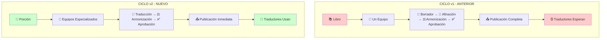
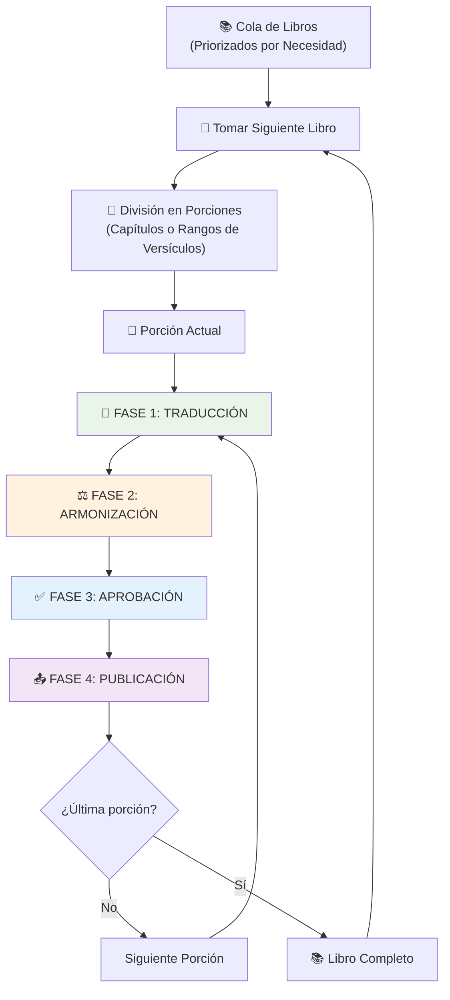
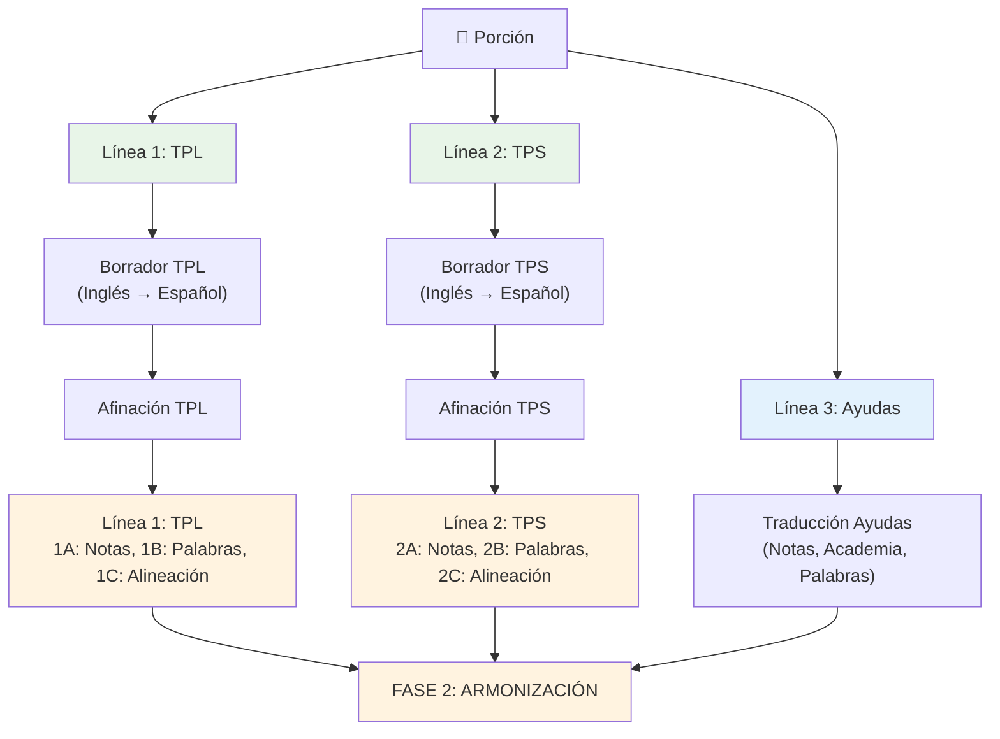
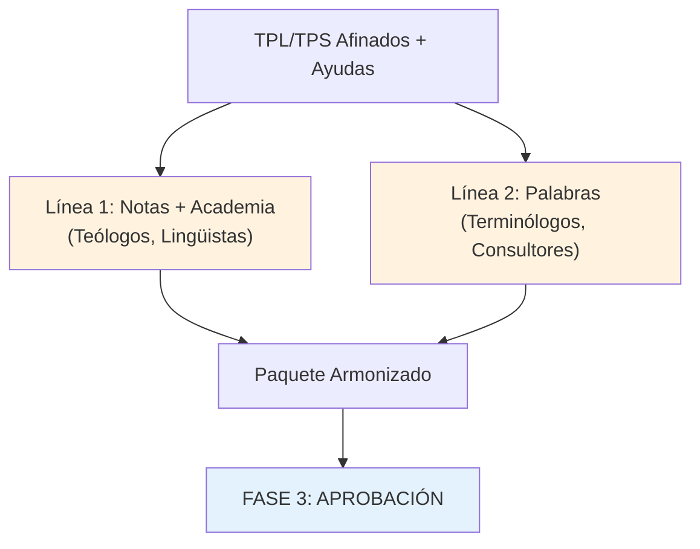

# Ciclo de Creación de Recursos v2 - Guía de Migración

## Modelo de Traducción y Adaptación de Recursos Bíblicos

### Del Inglés al Castellano para Traducción Multilingüe

---

## Índice

1. [Resumen Ejecutivo](#resumen-ejecutivo)
2. [Diferencias Clave: v1 vs v2](#diferencias-clave-v1-vs-v2)
3. [Proceso del Modelo v2](#proceso-del-modelo-v2)
4. [Especificaciones de Personal](#especificaciones-de-personal)
5. [Herramientas por Fase](#herramientas-por-fase)
6. [Criterios de Selección de Modelo](#criterios-de-selección-de-modelo)

---

## Resumen Ejecutivo

El **Ciclo de Creación de Recursos v2** es una evolución del modelo anterior que optimiza la producción de paquetes de traducción bíblica mediante equipos especializados y publicación progresiva.

### Objetivo Principal

Crear paquetes de traducción completos (TPL, TPS y ayudas) que faciliten una traducción bíblica **Clara, Natural y Fiel** desde castellano hacia lenguas indígenas.

### Innovación Clave

**Publicación Progresiva**: Cada porción terminada se publica inmediatamente, reduciendo 80-90% el tiempo de espera de las OL para tener recursos utilizables y accesibles.

---

## Diferencias Clave: v1 vs v2

| Aspecto | Ciclo v1 (Anterior) | Ciclo v2 (Nuevo) |
|---------|-------------------|------------------|
| **Equipos** | Un equipo rotando por todas las fases | Equipos especializados fijos por fase |
| **Publicación** | Al completar libro completo | Porción por porción (progresiva) |
| **Coordinación** | Coordinador general + coordinador por libro | Coordinador general + coordinadores especializados |
| **Flujo** | Secuencial (una fase a la vez) | Paralelo (todas las fases activas) |
| **Especialización** | Generalistas | Expertos por fase específica |
| **Tamaño Mínimo** | ~10-15 personas | ~27-31 personas |

### Cuándo Usar Cada Versión

### Comparación Visual de Modelos



#### Cuándo Usar Cada Versión

- **v1**: 10-20 personas, recursos limitados, equipos nuevos
- **v2**: 25+ personas, múltiples iglesias, proyecto maduro

---

## Proceso del Modelo v2

### Flujo General

**Inglés** → **Castellano** → **Lenguas Indígenas/Minoritarias**

### Diagrama General del Proceso



### Detalle de Fase 1: Traducción



### Detalle de Fase 2: Armonización



#### 🎵 Metáfora Musical: La Sinfonía de la Traducción

El proceso de creación de recursos es como la preparación de una **sinfonía bíblica**:

**🎼 La Afinación (Fase 1)**:

- Así como los músicos **afinan sus instrumentos** antes del concierto, el TPL y TPS se **afinan** con los textos originales (hebreo y griego)
- Esta afinación establece el **tono fundamental** - la referencia precisa que guiará toda la interpretación
- Sin una afinación correcta, toda la sinfonía sonaría desafinada, sin importar cuán bien toquen los músicos

**🎶 La Armonización (Fase 2)**:

- Una vez que los instrumentos principales (TPL y TPS) están **perfectamente afinados**, las ayudas (notas, academia, palabras) se **armonizan** con este tono
- Como los instrumentos de acompañamiento que siguen la melodía principal, las ayudas se ajustan para crear un **paquete armonioso**
- El resultado es una **sinfonía coherente** donde cada componente complementa y enriquece el conjunto

**🎯 El Principio Fundamental**:
El TPL y TPS afinados son como el **diapasón** de la orquesta - marcan la referencia exacta que todos los demás componentes deben seguir para lograr la armonía perfecta.

**Resultado**: Un paquete de traducción donde todos los componentes "suenan" en perfecta armonía, facilitando una traducción **Clara, Natural y Fiel** hacia lenguas indígenas.

---

## Especificaciones de Personal

### Estructura General

| Equipo | Función Principal | Cantidad | Perfil Principal | Seniors Mínimos |
|--------|-------------------|----------|------------------|-----------------|
| **Equipo 1** | Borrador TPL | 4 + 1 coordinador | Traductores inglés-español | 1 bilingüe avanzado |
| **Equipo 2** | Borrador TPS | 4 + 1 coordinador | Traductores inglés-español | 1 bilingüe avanzado |
| **Equipo 3** | Borrador Ayudas | 6 + 1 coordinador | Traductores inglés-español | 1 bilingüe avanzado |
| **Equipo 4** | Afinación (2 líneas principales, 6 sublíneas) | 4-6 especialistas + aprendices + coordinador | Especialistas en lenguas originales + disponibilidad para reuniones | **4 especialistas avanzados** |
| **Equipo 5** | Armonización (2 líneas) | 4 especialistas + aprendices + coordinador | Teólogos, lingüistas, terminólogos + disponibilidad para reuniones | 1 especialista avanzado |
| **Comité** | Aprobación | 4 pastores | Pastores comprometidos con misiones |
| **Especialista** | Publicación | 1 persona | Especialista técnico |

**Total mínimo**: 27 personas (22 + 5 coordinadores especializados)

- **Seniors requeridos**: 8 mínimo (1 por equipo + 3 adicionales en Equipo 4)
- Equipos 4 y 5: Máximo 4 especialistas cada uno + aprendices adicionales
**Total ideal**: 31+ personas (26 + 5 coordinadores + aprendices)

**Distribución de Seniors**:

- Equipos 1, 2, 3, 5: 1 senior cada uno (4 total)
- Equipo 4: 4 seniors mínimo
- **Total seniors**: 8 personas con nivel avanzado/especializado

### Perfiles Detallados por Equipo

#### Consideraciones Fundamentales

**Descripción de un Ideal**:
Los perfiles y requerimientos que se describen a continuación representan una **configuración ideal**, siendo conscientes de que no siempre será posible tener especialistas en cada fase del proceso. Pero sí los suficientes en las fases claves para que el proceso se realice de manera eficiente y efectiva.

**Dependencia completa**:
Nuestra dependencia total es del **Espíritu Santo**, confiando en la **dirección de Dios** y en que Él añadirá a las personas idóneas según Su voluntad y tiempo. Como respuesta a esta dependencia, tenemos el compromiso con Dios de **continuar capacitándonos** y desarrollar fielmente las habilidades que Él nos ha confiado.

**Principio de Crecimiento**:

- **Comenzar con lo disponible**: Usar el personal que Dios ha provisto
- **Capacitación continua**: Desarrollar habilidades en el equipo actual
- **Confianza en la provisión divina**: Dios añadirá nuevos especialistas según Su plan
- **Flexibilidad y adaptación**: Ajustar roles según los recursos que Dios provee

**Estrategia de Capacitación y Mantenimiento**:
Como forma de **probar a nuevos miembros** del equipo y mantener **actualizadas y revisadas** las traducciones actuales, los **nuevos traductores y verificadores** pueden revisar los **paquetes ya publicados**. Esto sirve un doble propósito:

- **Capacitación práctica**: Nuevos miembros aprenden estándares y metodología
- **Mejora continua**: Paquetes publicados se mantienen actualizados y refinados

---

#### Equipo 1: Borrador TPL (4 personas + coordinador)

**Perfil**:

- Conocimiento de inglés intermedio o superior
- Enfoque en fidelidad estructural y formal
- Disponibilidad: 8-10 horas/semana

**Rol Senior (mínimo 1 por equipo)**:

- **Bilingüe nivel avanzado** (inglés-español)
- Experiencia en traducción literal y fidelidad textual
- Capacidad de mentoría y supervisión de calidad

**Función**:

- Traducción inicial inglés → español manteniendo estructuras literales
- Fuente: ULT y recursos bíblicos en inglés

**Herramientas**: Google Docs + preview.door43.org (ULT)

**Requisitos para Aprendices**:

- **Formación activa en inglés** (nivel intermedio en progreso)
- **Formación en gramática** española (comprensión de estructuras)
- **Interés en traducción literal** y fidelidad textual

#### Equipo 2: Borrador TPS (4 personas + coordinador)

**Perfil**:

- Conocimiento de inglés intermedio o superior  
- Enfoque en naturalidad y accesibilidad
- Disponibilidad: 8-10 horas/semana

**Rol Senior (mínimo 1 por equipo)**:

- **Bilingüe nivel avanzado** (inglés-español)
- Experiencia en traducción comunicativa y simplificación
- Capacidad de mentoría y supervisión de calidad

**Función**:

- Traducción inicial inglés → español priorizando claridad
- Fuente: UST y recursos bíblicos en inglés

**Herramientas**: Google Docs + preview.door43.org (UST)

**Requisitos para Aprendices**:

- **Formación activa en inglés** (nivel intermedio en progreso)
- **Formación en traducción** (técnicas de simplificación y claridad)
- **Sensibilidad comunicativa** para audiencias diversas

#### Equipo 3: Borrador Ayudas (6 personas + coordinador)

**Perfil**:

- Traductores inglés-español
- Traducción directa (sin especialización teológica requerida)
- Disponibilidad: 6-8 horas/semana

**Rol Senior (mínimo 1 por equipo)**:

- **Bilingüe nivel avanzado** (inglés-español)
- Experiencia en traducción de material técnico y terminología
- Capacidad de mentoría y supervisión de calidad

**Función**:

- Traducción de notas, academia, palabras y preguntas desde inglés
- Trabajo paralelo a equipos TPL/TPS

**Herramientas**: translationCore Create (tCC)

**Requisitos para Aprendices**:

- **Formación activa en inglés** (nivel básico-intermedio en progreso)
- **Formación en traducción** general (técnicas básicas)
- **Interés en terminología** bíblica y conceptos teológicos

#### Equipo 4: Afinación (4-8 personas + coordinador)

**Perfil**:

- **Crítico**: Especialistas en lenguas originales (hebreo y griego)
- Experiencia con herramientas de alineación
- **Disponibilidad para reuniones virtuales**: Participación activa en llamadas
- Disponibilidad: 3-5 horas/semana (considerando que la mayoría son pastores con múltiples ministerios)

**Rol Senior (mínimo 4 por equipo)**:

- **Especialistas avanzados** en lenguas originales (hebreo y/o griego)
- **Experiencia comprobada** en traducción bíblica y exégesis
- **Capacidad de liderazgo** en decisiones teológicas y lingüísticas
- **Mentoría especializada** para aprendices en lenguas originales

**Función**:

- Reajustar borradores TPL/TPS para fidelidad a originales (no al inglés)
- Fuente: Textos originales + inglés como referencia

**Herramientas**: translationCore + textos originales

**Estructura de Reuniones**:

- **Máximo 4 especialistas** por reunión (para reducir discusiones muy largas)
- **Aprendices adicionales** pueden participar para beneficiarse de discusiones
- **Reuniones virtuales regulares** para decisiones complejas

**Proceso interno (2 líneas principales con 3 sublíneas cada una)**:

**Línea 1: Afinación TPL**

- **Línea 1.A**: Afinación TPL usando Notas (verificación teológica)
- **Línea 1.B**: Afinación TPL usando Palabras (consistencia terminológica)  
- **Línea 1.C**: Alineación TPL (verificación con textos originales)

**Línea 2: Afinación TPS**

- **Línea 2.A**: Afinación TPS usando Notas (verificación teológica)
- **Línea 2.B**: Afinación TPS usando Palabras (consistencia terminológica)  
- **Línea 2.C**: Alineación TPS (verificación con textos originales)

**Flexibilidad según recursos humanos**:

- **6 líneas paralelas**: 1.A, 1.B, 1.C, 2.A, 2.B, 2.C (configuración ideal)
- **2 líneas paralelas**: TPL y TPS (cada una ejecuta A, B, C secuencialmente)
- **1 línea secuencial**: TPL completo, luego TPS completo (configuración mínima)

**Requisitos para Aprendices**:

- **Formación activa en griego** (Nuevo Testamento) o **hebreo** (Antiguo Testamento)
- **Formación en traducción** bíblica (principios de equivalencia)
- **Formación teológica** básica (comprensión de conceptos bíblicos)
- **Interés en lenguas originales** y exégesis bíblica

#### Equipo 5: Armonización (6 personas + coordinador)

**Perfil general**:

- **Disponibilidad para reuniones virtuales**: Participación activa en llamadas
- Disponibilidad: 6-8 horas/semana

**Rol Senior (mínimo 1 por equipo)**:

- **Especialista avanzado** en teología y/o lingüística aplicada
- **Experiencia comprobada** en traducción bíblica y terminología
- **Capacidad de síntesis** para integrar componentes diversos
- **Mentoría especializada** en metodología de armonización

**Estructura de Reuniones**:

- **Máximo 4 especialistas** por reunión (para evitar discusiones muy largas)
- **Aprendices adicionales** pueden participar para beneficiarse de discusiones
- **Reuniones virtuales regulares** para decisiones de armonización

**Línea 1 - Notas y Academia (3 personas)**:

- Teólogos con experiencia en traducción
- Lingüistas especializados en metodología
- Metodólogos de traducción bíblica

**Línea 2 - Palabras (3 personas)**:

- Terminólogos bíblicos
- Consultores con experiencia en otras lenguas
- Idealmente: experiencia con etnias objetivo

**Función**:

- Ajustar ayudas al "tono" del TPL y TPS afinados
- TPL (principalmente) y TPS (casos específicos) son la referencia

**Herramientas**: Gateway Edit (vista integrada por versículo)

**Requisitos para Aprendices**:

- **Formación teológica** activa (seminario, instituto bíblico)
- **Formación en traducción** o **lingüística** aplicada
- **Experiencia con etnias** o culturas minoritarias (deseable)
- **Interés en terminología** bíblica y metodología de traducción

#### Comité de Aprobación (Fase 3)

**Total: 4 pastores mínimo**

**Perfil requerido**:

- Pastores
- Comprometidos con misiones
- Diferentes denominaciones (diversidad estratégica)
- Reconocimiento en ámbito misionero hispano
- Autoridad en sus comunidades
- Disponibilidad: 2-4 horas/semana

#### Equipo de Publicación (Fase 4)

**Total: 1 persona**

**Perfil requerido**:

- Especialista técnico en sistemas Door43
- Conocimiento de control de versiones (Git)
- Gestión de metadatos y publicación
- Disponibilidad: 4-6 horas/semana

### Coordinación

**Coordinador General (1 persona)**:

- Supervisión general del proyecto
- Coordinación entre fases
- Comunicación con iglesias participantes

**Coordinadores Especializados (5 personas)**:

- Un coordinador por equipo especializado
- **Ventaja v2**: Menor carga de trabajo (equipos ya dominan procesos)
- No requieren reintroducir fases constantemente

---

## Herramientas por Fase

### Fase 1: Traducción

**Borrador TPL/TPS**:

- **Google Docs**: Traducción colaborativa
- **preview.door43.org**: Consulta ULT/UST en inglés

**Traducción Ayudas**:

- **translationCore Create (tCC)**: Diseñada específicamente para ayudas

**Afinación**:

- **translationCore**: Afinación con griego/hebreo e inglés fuente

### Fase 2: Armonización

- **Gateway Edit**: Vista integrada de todos los componentes por versículo

### Fase 3: Aprobación

- **preview.door43.org**: Revisión de paquetes completos

### Fase 4: Publicación

- **git.door43.org**: Publicación final y gestión de versiones

### Herramientas de Colaboración

- WhatsApp (comunicación)
- Zoom/Teams (reuniones)
- Google Workspace (documentos colaborativos)

### Estrategia de Capacitación con Paquetes Publicados

**Propósito Dual**:

- **Capacitación de nuevos miembros**: Revisión de paquetes como entrenamiento práctico
- **Mantenimiento de calidad**: Actualización y refinamiento continuo de recursos

**Proceso**:

1. **Asignación inicial**: Nuevos traductores/verificadores revisan paquetes publicados
2. **Aprendizaje de estándares**: Familiarización con metodología y calidad esperada
3. **Identificación de mejoras**: Detección de áreas que requieren actualización
4. **Implementación de cambios**: Aplicación de mejoras identificadas
5. **Evaluación de competencia**: Valoración del desempeño del nuevo miembro

**Beneficios**:

- ✅ **Capacitación práctica** con material real del proyecto
- ✅ **Evaluación objetiva** de habilidades de nuevos miembros
- ✅ **Mejora continua** de paquetes ya publicados
- ✅ **Utilización eficiente** del tiempo de capacitación

---

## Criterios de Selección de Modelo

### Evaluación para Migración v1 → v2

| Criterio | Requisito v2 | Evaluación |
|----------|--------------|------------|
| **Tamaño del equipo** | 25+ personas | ¿Alcanzamos el mínimo? |
| **Iglesias participantes** | 6+ iglesias | ¿Tenemos compromiso suficiente? |
| **Especialistas disponibles** | Expertos por área | ¿Contamos con especialistas dedicados? |
| **Frecuencia de publicación** | Recursos con más frecuencia | ¿Necesitamos publicar capítulos más seguido? |
| **Madurez del proyecto** | Experiencia establecida | ¿El equipo tiene experiencia previa? |

### Indicadores para Transición

**Migrar a v2 cuando**:

- Equipo alcanza 25+ personas activas
- 6+ iglesias comprometidas enviando voluntarios
- Especialistas disponibles para dedicación por área
- Necesidad de publicar recursos o capítulos con más frecuencia
- Modelo v1 se convierte en cuello de botella

### Proceso de Transición

#### Migración Estándar (Desde Cero)

1. **Evaluación de capacidades actuales**
2. **Redistribución en equipos especializados**
3. **Identificación de roles faltantes**
4. **Solicitud específica a iglesias**
5. **Configuración del nuevo modelo**
6. **Prueba piloto**
7. **Implementación completa**

#### Migración Progresiva (Con Libros en Proceso)

**Escenario**: Equipo v1 trabajando en 3 libros diferentes en distintas fases

**Estrategia**: Transición gradual manteniendo producción activa

##### Paso 1: Mapeo del Estado Actual

**Inventario de libros en proceso**:

```
Libro A: [Fase actual en v1] → Personal asignado: [X personas]
Libro B: [Fase actual en v1] → Personal asignado: [Y personas]  
Libro C: [Fase actual en v1] → Personal asignado: [Z personas]
```

**Evaluación de capacidades del personal**:

- Identificar fortalezas naturales de cada miembro
- Mapear experiencia previa por tipo de trabajo
- Determinar especialización preferida

##### Paso 2: Configuración de Equipos v2

**Crear equipos especializados con personal disponible**:

| Equipo v2 | Personal Inicial | Fuente |
|-----------|------------------|---------|
| **TPL** | [Nombres] | Miembros con experiencia en traducción literal |
| **TPS** | [Nombres] | Miembros con experiencia en simplificación |
| **Ayudas** | [Nombres] | Miembros con experiencia en notas/academia |
| **Afinación** | [Nombres] | Especialistas en lenguas originales |
| **Armonización** | [Nombres] | Teólogos/lingüistas del equipo actual |

**Nota**: Algunos equipos pueden iniciar con menos del mínimo ideal

##### Paso 3: Transición por Finalización de Fases

**Principio**: Cuando un miembro termina su trabajo en un paso del libro (v1), se reasigna al equipo v2 más apropiado

**Flujo de redistribución**:

```
Miembro termina Fase X en Libro A (v1)
    ↓
Evaluación: ¿Cuál es su mejor fit en v2?
    ↓
Asignación a Equipo Especializado v2
    ↓
Libro A continúa en siguiente fase (ahora en modelo v2)
```

##### Paso 4: Implementación Gradual por Libro

**Estrategia libro por libro**:

**Libro que termine primero → Migra completamente a v2**

- Personal liberado se redistribuye en equipos especializados
- Siguientes porciones de este libro siguen modelo v2
- Publicación progresiva inmediata

**Libros restantes → Migración al completar cada fase**

- Continúan en v1 hasta terminar fase actual
- Al finalizar fase, migran a modelo v2
- Personal se redistribuye según especialización

##### Paso 5: Consolidación Progresiva

**Conforme se liberan recursos**:

1. **Reforzar equipos v2** con personal redistribuido
2. **Alcanzar especificaciones mínimas** por equipo
3. **Optimizar flujo** basado en experiencia práctica
4. **Incorporar nuevos voluntarios** directamente en equipos v2

##### Flujo de Migración Progresiva

```mermaid
gantt
    title Migración Progresiva v1 → v2
    dateFormat X
    axisFormat %s
    
    section Libro A (4 personas)
    Armonización v1    :done, a1, 0, 3
    Aprobación v2      :active, a2, 3, 5
    Publicación v2     :a3, 5, 6
    
    section Libro B (3 personas)  
    Afinación v1       :done, b1, 0, 5
    Armonización v2    :active, b2, 5, 7
    Aprobación v2      :b3, 7, 8
    
    section Libro C (5 personas)
    Borrador v1        :done, c1, 0, 7
    Afinación v2       :active, c2, 7, 9
    Armonización v2    :c3, 9, 10
    
    section Equipos v2
    Configuración      :done, setup, 1, 2
    TPL (1→3 personas) :team1, 3, 10
    TPS (0→1 personas) :team2, 5, 10  
    Afinación (1→3)    :team3, 3, 10
    Armonización (2→2) :team4, 3, 10
```



**Redistribución por semana**:

- **Semana 3**: Libro A termina → 4 personas a equipos v2
- **Semana 5**: Libro B termina → 3 personas refuerzan equipos v2  
- **Semana 7**: Libro C termina → 5 personas completan equipos v2
- **Resultado**: Migración completa en 7 semanas

##### Ventajas y Consideraciones de la Migración Progresiva

**Ventajas clave**:

- ✅ **Continuidad**: Sin detener producción durante transición
- ✅ **Aprendizaje gradual**: Adaptación progresiva sin resistencia
- ✅ **Optimización temprana**: Ajustes basados en experiencia real
- ✅ **Gestión de riesgos**: Transición controlada y reversible

**Consideraciones prácticas**:

- 📋 **Coordinador de transición** dedicado al proceso
- 🔄 **Configuración paralela** de herramientas v2
- 📊 **Métricas mixtas** para ambos modelos
- 💬 **Comunicación intensificada** con equipos e iglesias

**Criterios de Éxito de la Migración**:

- [ ] Todos los libros migrados al modelo v2
- [ ] Equipos especializados funcionando con especificaciones mínimas
- [ ] Personal adaptado y productivo en nuevos roles
- [ ] Publicación progresiva implementada exitosamente
- [ ] Coordinadores especializados operando efectivamente

##### Migración con Personal Insuficiente

**Escenario**: Equipo actual no alcanza los 27-31 miembros mínimos para v2

**Principio Fundamental**:
Confiamos en que **Dios proveerá el personal necesario** según Su tiempo y propósito. Mientras tanto, trabajamos con **fidelidad y excelencia** usando los recursos que Él ha puesto a nuestra disposición.

**Estrategias de Adaptación**:

**1. Roles Múltiples Temporales**

- **Principio**: Miembros experimentados pueden participar en 2 equipos simultáneamente
- **Criterio**: Solo durante la transición hasta alcanzar personal suficiente
- **Priorización**: Mantener calidad sobre velocidad

**Configuración con Roles Múltiples**:

| Equipo | Mínimo Ideal | Configuración Temporal | Roles Múltiples |
|--------|--------------|------------------------|------------------|
| **Equipo 1: TPL** | 4 + coordinador | 2-3 personas | + miembros de Equipo 2 |
| **Equipo 2: TPS** | 4 + coordinador | 2-3 personas | + miembros de Equipo 1 |
| **Equipo 3: Ayudas** | 6 + coordinador | 3-4 personas | + miembros disponibles |
| **Equipo 4: Afinación** | 4-6 especialistas + coordinador | 2-3 especialistas | + apoyo de otros equipos (hasta 6 líneas paralelas) |
| **Equipo 5: Armonización** | 6 + coordinador | 3-4 personas | + coordinadores disponibles |

**2. Coordinadores como Trabajadores**

- **Coordinador-Trabajador**: Coordinan su equipo Y participan activamente en el trabajo
- **Carga dual**: Gestión (20-30%) + Producción (70-80%)
- **Beneficio**: Conocimiento directo del proceso que coordinan

**Estructura Híbrida de Coordinación**:

```
Coordinador General (1 persona)
├── Coordinador-Trabajador Equipo 1 (coordina + traduce TPL)
├── Coordinador-Trabajador Equipo 2 (coordina + traduce TPS)  
├── Coordinador-Trabajador Equipo 3 (coordina + traduce ayudas)
├── Coordinador-Trabajador Equipo 4 (coordina + afina)
└── Coordinador-Trabajador Equipo 5 (coordina + armoniza)
```

**3. Configuración Mínima Viable**

**Personal mínimo absoluto para v2 adaptado**:

- **Coordinador General**: 1 persona
- **Equipo 1 (TPL)**: 2 personas + coordinador-trabajador
- **Equipo 2 (TPS)**: 2 personas + coordinador-trabajador  
- **Equipo 3 (Ayudas)**: 3 personas + coordinador-trabajador
- **Equipo 4 (Afinación)**: 2 especialistas + coordinador-trabajador
- **Equipo 5 (Armonización)**: 3 personas + coordinador-trabajador
- **Comité Aprobación**: 4 pastores (sin cambio)
- **Especialista Publicación**: 1 persona

**Total mínimo adaptado**: 19-20 personas (vs. 32-36 ideal)

**4. Gestión de Roles Múltiples**

**Principios**:

- **Rol principal (70%)** + **Rol secundario (30%)**
- **Rotación inteligente**: Cuando Equipo A espera → Miembro trabaja en Equipo B
- **Prevención de fatiga**: Monitorear carga total de trabajo

**5. Plan de Crecimiento Gradual**

| Fase | Personal | Características |
|------|----------|-----------------|
| **Fase 1** | 19-20 personas | Roles múltiples + Coordinadores-trabajadores |
| **Fase 2** | 25-28 personas | Especialización parcial + Coordinadores mixtos |
| **Fase 3** | 32-36 personas | Especialización completa + Coordinadores dedicados |

**6. Ventajas del Modelo Adaptado**

- ✅ **Flexibilidad operativa**: Máximo aprovechamiento del personal
- ✅ **Desarrollo integral**: Personal con habilidades múltiples  
- ✅ **Viabilidad inmediata**: Implementar v2 sin esperar personal completo
- ✅ **Gestión optimizada**: Calendarios compartidos y priorización clara

---

## Ventajas del Modelo v2

| Área | Beneficios Clave |
|------|------------------|
| **🚀 Operativas** | Procesamiento paralelo • Publicación inmediata • Identificación clara de cuellos de botella |
| **📊 Gestión** | Coordinación simplificada • Escalabilidad • Medición clara por porciones |
| **✅ Calidad** | Especialización profunda • Consistencia terminológica • Herramientas especializadas |

---

Este documento proporciona la información esencial para evaluar y planificar la migración del Ciclo de Creación de Recursos v1 al v2, enfocándose en los aspectos críticos de proceso, personal y herramientas necesarias para la transición exitosa.
